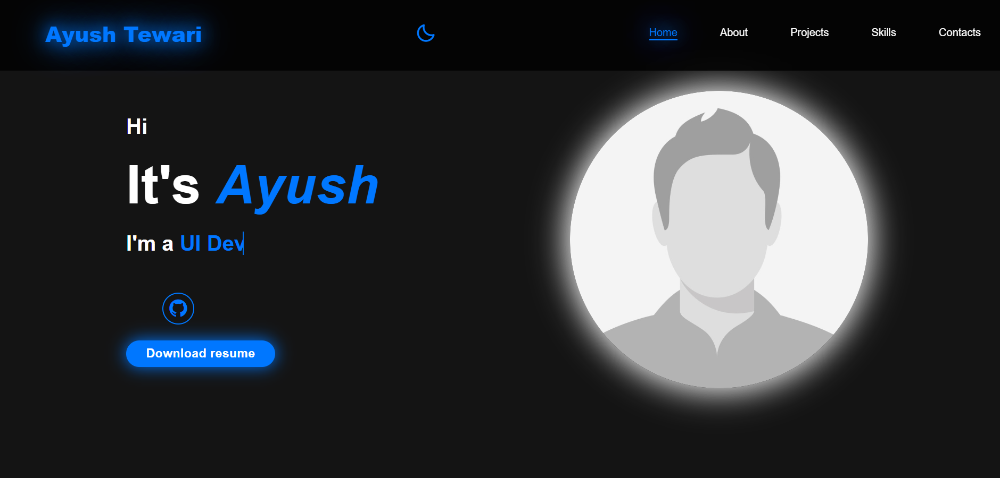

# 🎨 Modern Responsive Portfolio | Ayush Tewari

[](https://github.com/Ayush15601/Portfolio/blob/main/LICENSE)
[](https://github.com/Ayush15601/Portfolio/stargazers)
[](https://github.com/Ayush15601/Portfolio/network/members)
[](https://github.com/Ayush15601/Portfolio/issues)

Welcome to my personal portfolio repository! This is a modern, fast, and fully responsive portfolio website designed to showcase my projects, technical skill set, and frontend development experience.

---

## 📸 Preview



---

## 🚀 Key Features

*   **🌓 Seamless Theme Toggling:** Easily switch between Dark and Light mode. The preference is automatically persisted locally using `localStorage`.
*   **📱 Fully Fluid & Responsive:** Uses a modern layout built with CSS Flexbox, Grid, and fluid typography via `clamp()` to look stunning on mobile, tablet, and desktop viewports.
*   **🖱️ Dynamic Navigation:**
    *   **Sticky Glassmorphic Header** with backdrop blur (`backdrop-filter`).
    *   **Active Section Indicator:** Navigation links automatically highlight as you scroll through different sections.
    *   **Smooth Scroll:** Fluid scrolling behavior when clicking header items.
*   **📄 "Read More" Toggle:** Interactive content reveal in the About section for a cleaner initial UI.
*   **✉️ Functional Contact Form:** Integrated with **Formspree** for reliable, serverless email delivery, complete with custom client-side email format validation.
*   **📥 CV Download:** Includes a direct download link for a professional resume (`cv.pdf`).

---

## 🛠️ Tech Stack & Libraries

*   **HTML5:** Semantic architecture for SEO and screen-reader accessibility.
*   **CSS3:** Custom properties (CSS variables) for robust theme management, Flexbox/Grid for layout, and keyframe animations for interactive typing states.
*   **JavaScript (ES6+):** Vanilla JS for DOM manipulation, menu toggles, scroll checking, theme management, and validation.
*   **Icons:** [Boxicons](https://boxicons.com/) for rich vector iconography.

---

## 📂 Project Structure

```text
├── assets/
│   ├── cv.pdf                   # Downloadable Resume
│   ├── favicon.png              # Site Favicon
│   ├── image.jpg                # Profile pictures
│   ├── movie.png                # Movie Search App screenshot
│   ├── e commerce.png           # E-Commerce Cart screenshot
│   ├── gpt.png                  # ChatGPT Clone screenshot
│   └── portfolio-preview.png    # Portfolio preview image
├── index.html                   # Main page layout & semantic structure
├── style.css                    # Custom styles (layout, dark/light themes, animations)
├── script.js                    # UI interactivity & utility scripts
├── LICENSE                      # Open source license
└── README.md                    # Project documentation
```

---

## 🖥️ Local Setup & Installation

To run this project locally, follow these simple steps:

1.  **Clone the Repository:**
    ```bash
    git clone https://github.com/Ayush15601/Portfolio.git
    cd Portfolio
    ```

2.  **Open the Project:**
    Simply open the `index.html` file directly in your web browser, or use a development server like VS Code's **Live Server** extension to preview it on `http://127.0.0.1:5500`.

---

## 🌟 Featured Projects

In addition to this portfolio, check out some of my key projects:

*   **🌤️ [e-commerce_cart](https://github.com/Ayush15601/e-commerce_cart)**
    *   *Description:* A responsive React-Redux e-commerce app featuring product search, cart quantity management, and a persistent dark/light theme toggle.
*   **🎬 [Movie Search Engine App](https://github.com/Ayush15601/Movie_search_engine)**
    *   *Description:* A movie discovery dashboard utilizing React and the TMDB API to search for films, view trending lists, and check ratings/overviews.
*   **🤖 [ChatGPT Clone](https://github.com/Ayush15601/chat-gpt-clone)**
    *   *Description:* A responsive ChatGPT clone built with React providing real-time AI conversations.

---

## 📬 Connect With Me

*   **GitHub:** [@Ayush15601](https://github.com/Ayush15601)
*   **Contact Page:** Drop me a message via the [Contact Section](https://ayush15601.github.io/Portfolio/#contact)!

---

## 👤 Author

* **Ayush**

---

## 📄 License

This project is licensed under the [MIT License](LICENSE) - see the [LICENSE](LICENSE) file for details.
